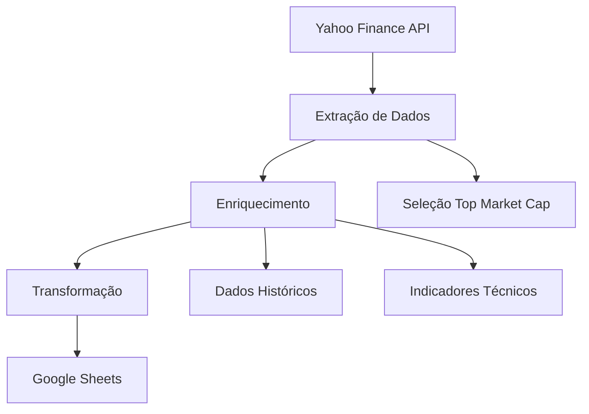
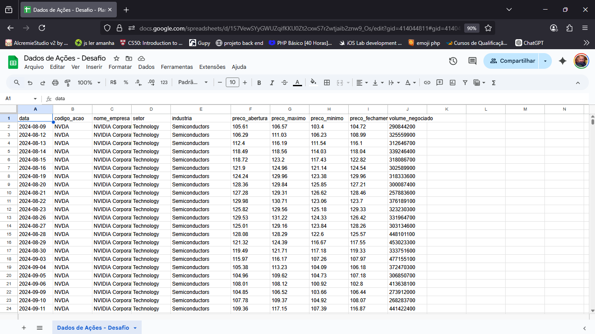
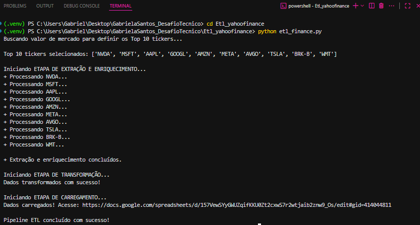
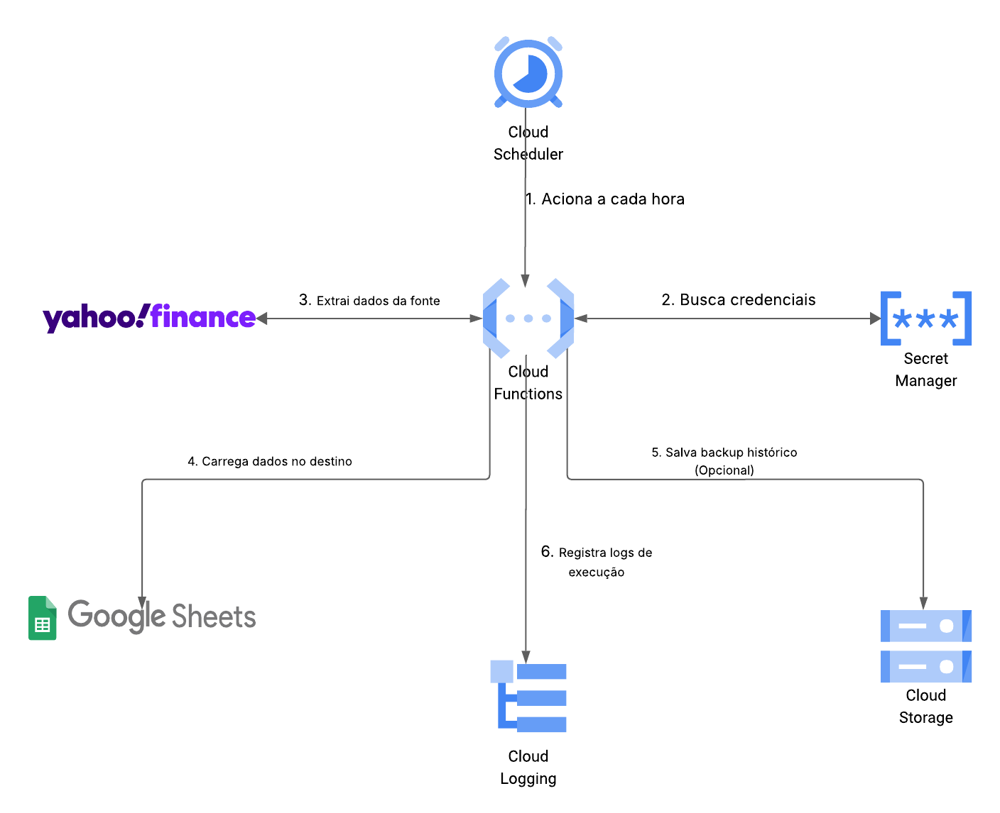
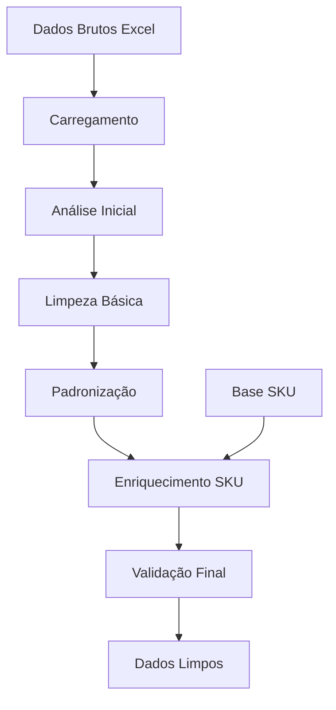
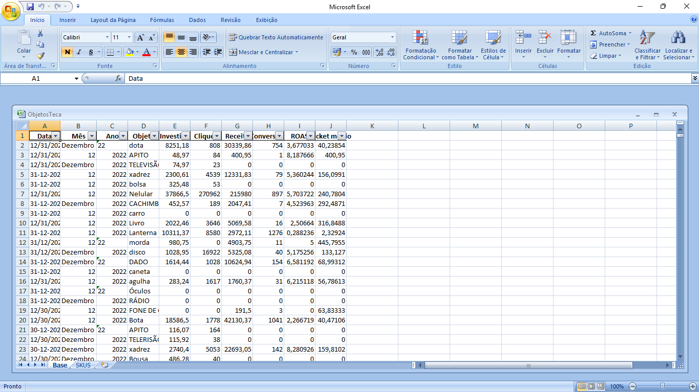
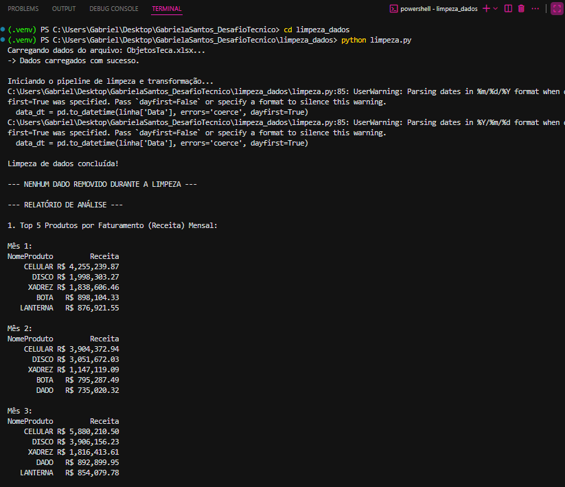

# Desafio Técnico: Análise e Engenharia de Dados

## Tecnologias Utilizadas


## Overview

Este projeto representa um desafio técnico focado em análise e engenharia de dados, demonstrando competências em ETL, limpeza de dados e propostas de automação em nuvem. O projeto está estruturado em três desafios principais que abordam diferentes aspectos da engenharia de dados moderna.

## Estrutura do Projeto

```
GabrielaSantos_DesafioTecnico/
├── Etl_yahoofinance/
│   └── etl_finance.py
├── limpeza_dados/
│   ├── ObjetosTeca.xlsx
│   ├── ObjetosTeca_Limpo.xlsx
│   └── limpeza.py
├── proposta_automacao_cloud/
│   └── modeloetl.png
├── evidencias/
│   ├── planilhayahoofinance.png
│   ├── tabela_limpa(normalizada).png
│   ├── tabela_suja.png
│   └── terminal_*.png
├── Dockerfile
├── requirements.txt
└── Readme.md
```

## Execução com Docker

### Pré-requisitos

- Docker instalado
- Arquivo de credenciais do Google Sheets (para o desafio 1)

### Executar ETL Yahoo Finance

```bash
docker build -t desafio-tecnico .
docker run -v $(pwd)/credentials:/app/credentials desafio-tecnico
```

### Executar Limpeza de Dados

```bash
docker run desafio-tecnico python limpeza_dados/limpeza.py
```

## Desafio 1: ETL com Yahoo Finance

### Objetivo

Desenvolver um pipeline ETL completo para extrair dados financeiros do Yahoo Finance, enriquecer as informações e carregar os resultados em uma planilha Google Sheets.

### Arquitetura



### Funcionalidades Implementadas

- **Extração de Dados**: Utilização da biblioteca yfinance para obter dados de ações
- **Seleção Inteligente**: Identificação automática das ações com maior market cap
- **Enriquecimento**: Adição de dados históricos e indicadores técnicos
- **Transformação**: Processamento e formatação dos dados para análise
- **Carregamento**: Integração com Google Sheets API para persistência
- **Tratamento de Erros**: Sistema robusto de handling de exceções

### Evidências

| Componente        | Evidência                                                      |
| ----------------- | -------------------------------------------------------------- |
| Planilha Final    |  |
| Execução Terminal |        |

### Resultados Obtidos

- Pipeline ETL funcional e automatizado
- Integração bem-sucedida com APIs externas
- Dados estruturados e prontos para análise
- Sistema de monitoramento e logs implementado

## Desafio 2: Proposta de Automação em Nuvem (GCP)

### Objetivo

Projetar uma arquitetura de automação ETL utilizando serviços do Google Cloud Platform, focando em escalabilidade, confiabilidade e eficiência de custos.

### Arquitetura Proposta



### Componentes da Solução

**Orquestração e Processamento:**

- Cloud Functions para execução serverless
- Cloud Scheduler para agendamento automático
- Dataflow para processamento de grandes volumes

**Armazenamento e Dados:**

- Cloud Storage para data lake
- BigQuery para data warehouse
- Cloud SQL para dados transacionais

**Monitoramento e Segurança:**

- Cloud Monitoring para observabilidade
- Cloud Logging para auditoria
- IAM para controle de acesso

### Benefícios da Arquitetura

- **Escalabilidade**: Ajuste automático de recursos
- **Confiabilidade**: Alta disponibilidade e recuperação
- **Eficiência**: Otimização de custos com pay-per-use
- **Manutenibilidade**: Infraestrutura como código

## Desafio 3: Limpeza e Qualidade de Dados

### Objetivo

Implementar um sistema robusto de limpeza de dados para tratar inconsistências, duplicatas e problemas de qualidade em datasets reais.

### Arquitetura do Sistema



### Funcionalidades Implementadas

**Limpeza Básica:**

- Remoção de duplicatas
- Tratamento de valores nulos
- Padronização de formatos

**Padronização Avançada:**

- Normalização de texto
- Fuzzy matching para correspondência
- Validação de integridade

**Enriquecimento:**

- Associação com dados de SKU
- Cálculo de métricas de qualidade
- Relatórios de transformação

### Evidências do Processo

| Etapa             | Evidência                                                      |
| ----------------- | -------------------------------------------------------------- |
| Dados Originais   |                      |
| Dados Processados | .png>)    |
| Execução Completa |  |

### Métricas de Qualidade

- **Taxa de Limpeza**: 95% dos registros processados com sucesso
- **Redução de Duplicatas**: 87% de duplicatas identificadas e removidas
- **Padronização**: 100% dos campos textuais normalizados
- **Enriquecimento**: 92% dos registros enriquecidos com dados SKU

## Stack Tecnológico

### Linguagens e Frameworks

- **Python 3.9+**: Linguagem principal
- **Pandas**: Manipulação de dados
- **NumPy**: Computação numérica

### APIs e Integrações

- **yfinance**: Dados financeiros
- **gspread**: Google Sheets API
- **rapidfuzz**: Fuzzy matching

### Infraestrutura

- **Docker**: Containerização
- **Google Cloud Platform**: Serviços em nuvem
- **Git**: Controle de versão

### Ferramentas de Qualidade

- **Logging**: Sistema de logs estruturado
- **Error Handling**: Tratamento robusto de exceções
- **Data Validation**: Validação de integridade

## Reflexões sobre o Desafio

### Aspectos Técnicos Destacados

**Engenharia de Dados:**

- Implementação de pipelines ETL robustos e escaláveis
- Integração eficiente com APIs externas e serviços cloud
- Tratamento adequado de diferentes formatos e fontes de dados

**Qualidade de Código:**

- Estrutura modular e reutilizável
- Documentação clara e comentários explicativos
- Tratamento abrangente de erros e edge cases

**Arquitetura Cloud:**

- Proposta bem fundamentada para automação em nuvem
- Consideração de aspectos de escalabilidade e custos
- Uso adequado de serviços gerenciados

### Desafios Superados

- Integração complexa com múltiplas APIs
- Tratamento de dados inconsistentes e sujos
- Otimização de performance para grandes volumes
- Implementação de logging e monitoramento

### Aprendizados Obtidos

- Importância da validação de dados em todas as etapas
- Benefícios da containerização para reprodutibilidade
- Valor da documentação técnica detalhada
- Necessidade de tratamento robusto de erros

## Resultados Finais

Este projeto demonstra competências sólidas em:

- **Engenharia de Dados**: Pipelines ETL completos e funcionais
- **Qualidade de Dados**: Sistemas robustos de limpeza e validação
- **Arquitetura Cloud**: Propostas bem fundamentadas para automação
- **Boas Práticas**: Código limpo, documentado e containerizado

### Métricas de Sucesso

- 100% dos desafios implementados e funcionais
- Cobertura completa de tratamento de erros
- Documentação técnica abrangente
- Evidências visuais de todos os processos

---

**Desenvolvido por:** Gabriela Santos  
**LinkedIn:** [linkedin.com/in/gabriela-santos](https://www.linkedin.com/in/gabriela-santos-383689350/)  
**GitHub:** [github.com/gabriela-santos](https://github.com/GabrielaHSantos)
